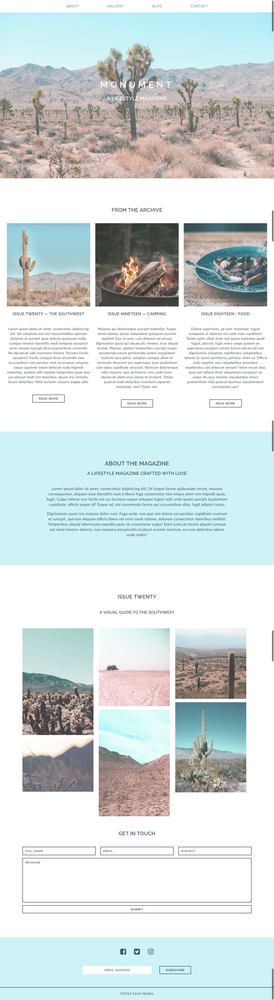

#  Monument Refactor (React)

## Overview

#### What is this lab?

Today we're going to modernize Monument, a static magazine website. It is now time to refactor some code for use with a modern front-end library: React!

**The objective of this lab is to:**

* Refactor a static html site to use a component-based approach
* Familiarize yourself with React's filesystem and architecture on your terms
* Create a reusable, robust codebase that can serve as a boilerplate for other work

## Refactor!

**To refactor the Monument site, first clone this repo**
  
  What's included in this repo?

  * `screenshots` directory, which should guide your CSS
  * `static-starter-site` directory, which is the website we want to refactor. The site has:
    * two webpages, represented in the html files `index` and `blog`
    * a CSS directory
    * the images you'll need to use in your React site

**Suggested implementation**
1. Create a React application in a new directory. The path to your react app should look something like this: `monument-react-refactor/react-directory-for-refactor` - meaning the React app is on the same level as the README and the screenshots directory.
2. Copy *all* of your `html` content (minus the `head` tag) into a new React component.
3. Copy images and css into a `public` folder.
4. Link all of the images and styles into your new component. You may overwrite the `index.css` with the original *static-starter-site* css.
5. Separate the different pieces of the html into small, logical components. 

**Suggested components for `index.html`:**

    - NavBar
    - Landing
      - Header
      - Archive
        - Article
        - Article
        - Article
      - About
      - Gallery
      - Contact
    - Footer

**Suggested components for `blog.html`:**

    - NavBar
    - Blog
      - Header
      - Article
      - Sidebar
      - Comment
    - Footer

Keep components as large as possible until you begin to see opportunities to capitalize on repetition or obvious semantic separations, such as articles, sections, header/main/footer, etc. This will keep your workflow comprehensive and straightforward.  One early but major pitfall of React development is the tendency to prematurely optimize components to their smallest kernels. Taking the time to work incrementally ensures consistent code.
The `blog` and `index` page may share components, but for better organization you can import each piece into a larger `blog-component` and `landing-page-component`.
The goal of this assignment to review and understand the static html site, and translate that into React components that can be rendered without routing. You can demonstrate the switch between pages by commenting out one page's components at a time. 

# Mockups

## Landing Page

## Blog Page

